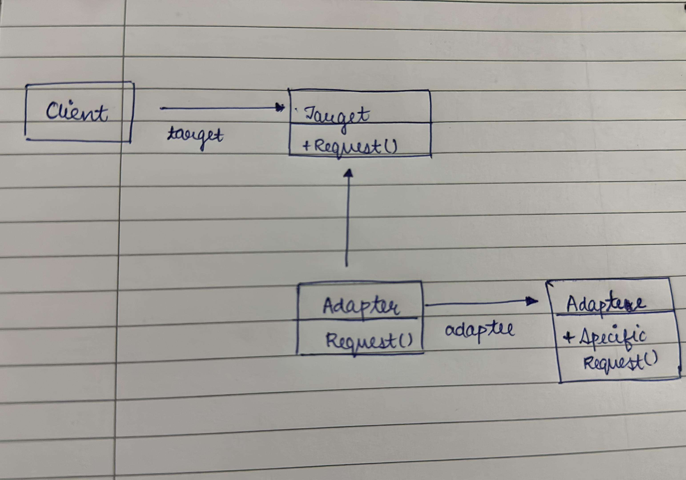

# Adapter Design Pattern

The Adapter Design Pattern is a Structural Design Pattern that allows incompatible interfaces (objects) to work together. The Adapter Design Pattern acts as a bridge between two incompatible objects. For example consider a USB to Ethernet adapter. We need this when we have an Ethernet interface on one end and USB on the other. Since they are incompatible with each other, we use an adapter that converts one to other. This example is pretty analogous to Object Oriented Adapters. In design, adapters are used when we have a class (Client) expecting some type of object and we have an object (Adaptee) offering the same features but exposing a different interface.

To use an adapter:

- The client makes a request to the adapter by calling a method on it using the target interface.
- The adapter translates that request on the adaptee using the adaptee interface.
- Client receive the results of the call and is unaware of adapter’s presence.

## Introduction

The project presents a challenge where the Salary Depositor expects data in the form of List, while the Existing System stores employee information as a string array. These differing formats make direct communication between the two systems impossible.

- Solution:

    The solution involves introducing an Adapter between the existing System and the new System. The Adapter acts as a bridge, transforming the string array from the existing System into List<Employee> format that the Salary Depositor System can process.

## Design

The adapter pattern convert the interface of a class into another interface clients expect. Adapter lets classes work together that couldn’t otherwise because of incompatible interfaces. The client sees only the target interface and not the adapter. The adapter implements the target interface. Adapter delegates all requests to Adaptee.

## Environment

The project builds and runs with Visual Studio Community 2022 when the required workloads are installed.
